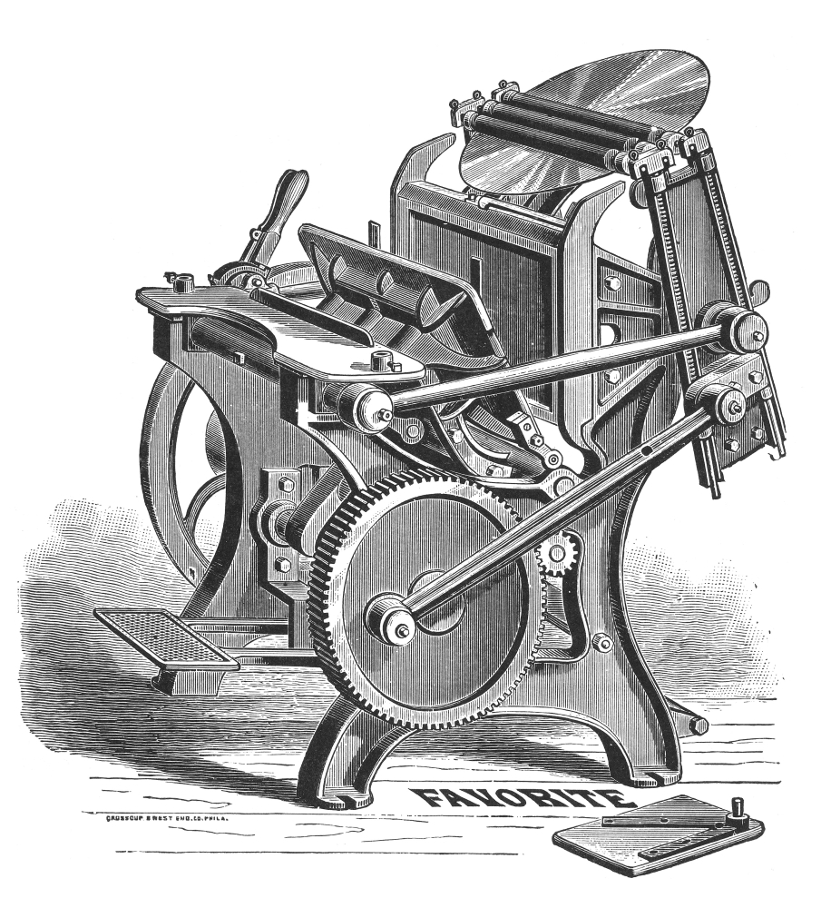

<!--  -->

<!-- ## The js library that prints the web -->

<!-- ---  -->

<!--  -->

<!-- {{}} -->

**Paged.js** is an open source and free library to paginate content in the browser, to turn webpages in beautiful PDF. If it's your first encounter with the project, you may want to [read a bit about how it came to life](about). You may also want to [test the library in our Codepen](codepen) or [follow the documentation](doc).

Or maybe, you want to read the [latest news](blog/) around Paged.js and CSS print.

